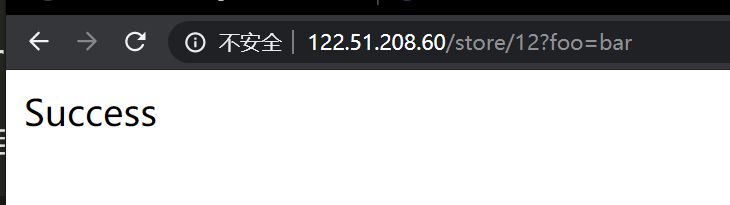
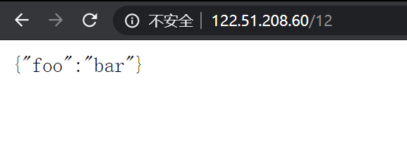
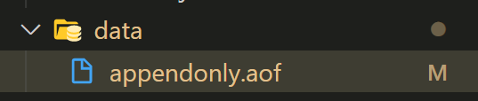

# Centos7 Docker+Node+Redis+Nginx环境搭建

## 安装Docker环境

### 使用bin

从官网[下载](https://download.docker.com/linux/static/stable/)对应版本的bin，解压到/usr/local/bin并启动dockerd。

```bash
$ dockerd &
```

### （或）yum安装Docker

+ 安装依赖
```bash
$ sudo yum install -y yum-utils \
  device-mapper-persistent-data \
  lvm2
```

+ 添加镜像源
```bash
$ sudo yum-config-manager \
    --add-repo \
    https://download.docker.com/linux/centos/docker-ce.repo
```

+ 安装运行

```bash
$ sudo yum install docker-ce docker-ce-cli containerd.io
$ sudo systemctl start docker
```

### 安装Docker-Compose

下载[docker-compose](https://github.com/docker/compose/releases)，复制到/usr/local/bin，并添加可执行权限。
```bash
$ chmod +x docker-compose
```

### 安装镜像

分别下载[Redis](https://hub.docker.com/_/redis)、[Nginx](https://hub.docker.com/_/nginx)、[Node](https://hub.docker.com/_/node)镜像到本地。
```bash
## alpine镜像体积较小，建议使用
## 具体版本号可以在DockerHub上查，默认是最新版
$ docker pull redis:alpine
$ docker pull nginx:alpine
$ docker pull node:alpine
```

### 导出&导入镜像

```bash
## 导出
$ docker save redis:apline nginx:alpine node:alpine > images.docker

## 导入
$ docker load < images.docker
```

## 使用Docker-Compose组织项目

为了简化操作，这里express搭建一个简单的http服务器，通过nginx转发请求，对redis进行读写。

### 目录

```
composedir
    |app
      |Dockerfile
      |redis-client.js
      |server.js
      |package.json
    |nginx_conf
      |default.conf
    |redis_conf
      |redis.conf
    |docker-compose.yml
```

### Server

```js
//redis-client.js
const redis = require('redis');
const {promisify} = require('util');
const client = redis.createClient(process.env.REDIS_URL);

module.exports = {
  ...client,
  getAsync: promisify(client.get).bind(client),
  setAsync: promisify(client.set).bind(client),
  keysAsync: promisify(client.keys).bind(client)
};

//server.js
const express = require('express');
const app = express();
const redisClient = require('./redis-client');

app.get('/store/:key', async (req, res) => {
  const { key } = req.params;
  const value = req.query;
  await redisClient.setAsync(key, JSON.stringify(value));
  return res.send('Success');
});

app.get('/:key', async (req, res) => {
  const { key } = req.params;
  const rawData = await redisClient.getAsync(key);
  return res.json(JSON.parse(rawData));
});

app.get('/', (req, res) => {
  return res.send('Whos your daddy');
});

const PORT = process.env.PORT || 3000;
app.listen(PORT, () => {
  console.log(`Server listening on port ${PORT}`);
});

```

### 配置compose

在app目录下创建Dockerfile文件，设置node版本。
```dockerfile
FROM node:alpine
WORKDIR '/var/www/app'
```

在主目录下创建docker-compose.yml，写入工程配置信息。
```yml
version: '3'
services:
  redis:
    image: "redis:alpine"
    container_name: db
    volumes:
      ## 使用自定义配置
      - ./redis_conf/redis.conf:/etc/redis/redis.conf
      ## redis持久化保存路径
      - ./data:/data
    entrypoint: redis-server --appendonly yes
  nginx:
    image: "nginx:alpine"
    restart: always
    container_name: ng
    ports:
      ## 映射物理机端口
      - 80:80
      - 443:443
    volumes:
      - ./nginx_conf:/etc/nginx/conf.d
      - ./nginx_log/:/var/log/nginx
  app:
    build: ./app
    expose:
      ## 打开端口
      - 5000
    environment:
      ## 设置环境变量
      - REDIS_URL=redis://db
      - PORT=5000
    command:
      ## 联网安装后直接把node_modules打包就可以离线跑了
      sh -c 'npm i && node server.js'
```

### redis配置

打开aof持久化，设置目录为/data。
```
...
appendonly yes
appendfsync everysec
dir /data
...
```

### nginx配置

转发http请求到app:5000。
```
server {
    listen 80;
    server_name ng_localhost;

    location / {
        proxy_pass http://app:5000;
    }
}
```

### 启动server

进入工程主目录（docker-compose.yml所在目录），输入：
```bash
$ docker-compose up
```

### 访问server





同时在data目录下会生成aof文件，记录了刚刚进行的数据库操作：




### docker-compose常用操作

```bash
## 查看
$ docker-compose ps

## 启动
$ docker-compose up

## 停止
$ docker-compose stop

## 重启
$ docker-compose restart <service>
```

## 新机器部署

1. 把docker和docker-compose的bin包导入
2. 执行dockerd &启动docker-engine
3. 执行docker load < image.docker导入镜像
4. clone工程代码，进入主目录，执行docker-compose up --build

## 代码更新
1. pull最新代码
2. 执行docker-compose restart app
